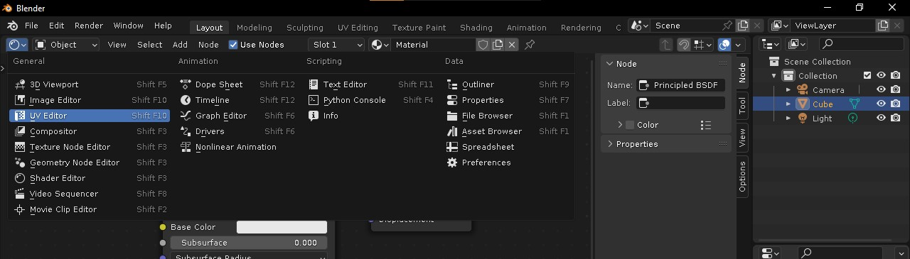
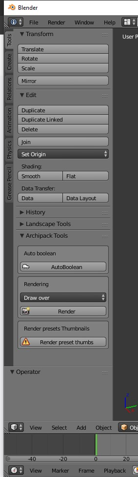
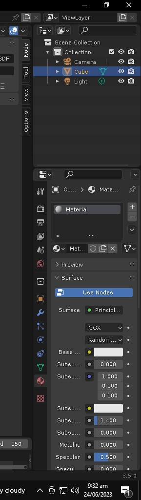
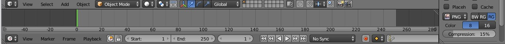
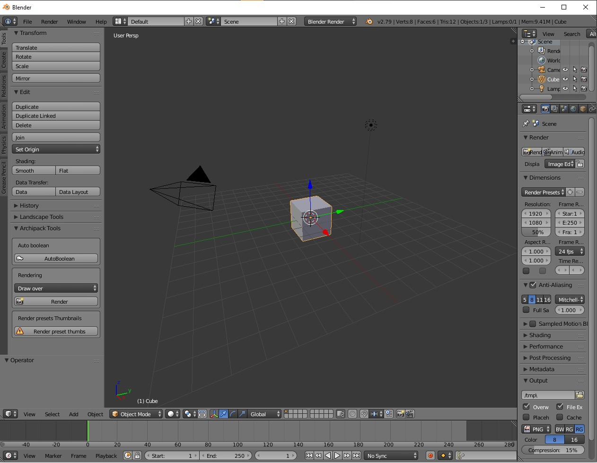
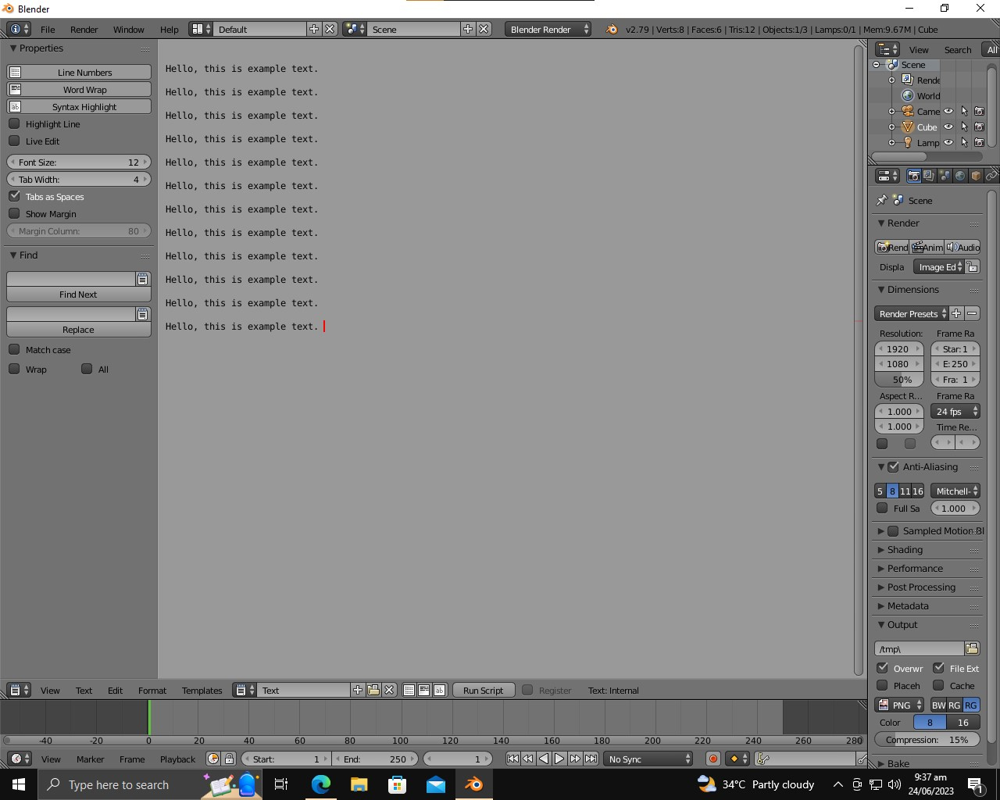

## "Unified AI Tool": UI Design Document

`Author: Mujtaba`
`Date: 24/6/2023`

### UI Design

#### 1: Main Page -

1. On top, there is a menu for switching between different windows. And, there are buttons for switching between different modes within a window (if applicable).

2. On left, there will be window-specific tools. For example, transformation tools, creation tools, selection tools, etc.

3. On right, there will be global tools, such as file management, resource-specific tools, etc.

4. On bottom, there will be a timeline, play button, resource save buttons etc.

Additional references:

